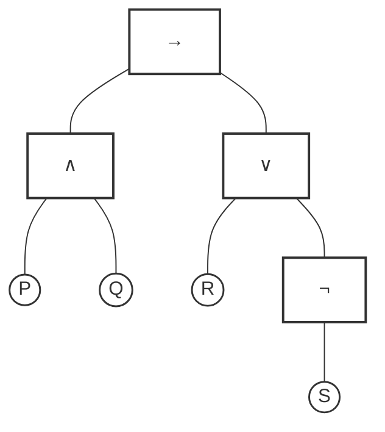

# 1.8 命题表达式：逻辑语言的组合规则

在前面的章节中，我们已经熟悉了合取、析取、蕴涵等算符。现在，我们需要像研究代数表达式一样，正式观察逻辑命题是如何组装而成的。其实我们之前已经在正文和习题中使用这些表达式了，在这里我们会进一步理解这些规则，并给它们之间的组合一个正式的规定。

## 1. 命题表达式

逻辑世界里的**命题表达式**是按照以下简单的规则构建的：

1.  **原子命题**：任何单个的命题字母（如 $P, Q, R$）都是一个最基础的表达式。
2.  **组合规则**：如果 $A$ 和 $B$ 是合法的表达式，那么我们可以通过算符将它们组合成更复杂的表达式：
    -   $\neg A$ （否定）
    -   $A \land B$ （合取）
    -   $A \lor B$ （析取）
    -   $A \to B$ （蕴涵）
    -   $A \leftrightarrow B$ （等价）
3.  **括号**：为了清楚表达运算的先后顺序，我们可以给表达式加上括号，如 $(A \to B)$。

这就像搭积木。原子命题是最小的单块积木，算符则是连接件。无论一个逻辑表达式多么复杂，它最终都可以拆解为一小块一小块积木的有序组合。这种“由简入繁”的特性，允许我们之后通过分析简单的部分来理解复杂的整体。

---

## 2. 算符优先级：谁先谁后？

在代数式中，我们知道 $2 + 3 \times 4$ 应该先算乘法。如果不规定先后顺序，逻辑表达式 $P \lor Q \land R$ 就会产生歧义：是先“或”再“且”，还是先“且”再“或”？

为了尽量少写繁琐的括号，我们规定逻辑算符的计算优先级如下（从高到低）：

1.  **$\neg$** （最高优先，紧跟命题）
2.  **$\land$**
3.  **$\lor$**
4.  **$\to$**
5.  **$\leftrightarrow$** （最低优先）

**示例：**
-   $\neg P \lor Q$ ：先处理否定，再处理析取。等价于 $(\neg P) \lor Q$。
-   $P \land Q \to R$ ：先将 $P, Q$ 结合，再看蕴涵关系。等价于 $(P \land Q) \to R$。
-   $P \to Q \leftrightarrow \neg Q \to \neg P$ ：先处理所有的否定，再处理两边的蕴涵，最后处理中间的等价。等价于 $(P \to Q) \leftrightarrow ((\neg Q) \to (\neg P))$。

---

## 3. 结合方向：当算符连着写时

当级别相同的算符连在一起用时，我们需要规定哪个算符是先算的。

### 左结合
**$\land$ 和 $\lor$** 默认是左结合的。
-   $P \land Q \land R$ 意为 $(P \land Q) \land R$。
-   $P \lor Q \lor R$ 意为 $(P \lor Q) \lor R$。

由于合取和析取满足结合律，顺序对结果没有影响，但在阅读习惯上，我们默认从左向右。

### 右结合
**蕴涵算符 $\to$** 默认是**右结合**的。
-   $P \to Q \to R$ 意为 **$P \to (Q \to R)$**。

这种右结合的习惯让我们可以省略掉嵌套在右侧的括号。这和 1.4 节习题3中提到的 **“柯里化（Currying）”** 密切相关。有了右结合约定，$(P \land Q) \to R$ 与 $P \to Q \to R$ 是等价的。我们以后在书写多前提推导时，只需要写成 $P \to Q \to R$ 即可。这会非常方便。

---

## 4. 语法树：逻辑的视觉化解构

为了更直观地理解复杂命题的层次，逻辑学家经常使用**语法树（Syntax Tree）**。树状图能让我们一眼看出谁是“树根”，谁是“枝叶”。

在语法树中，命题的组合规则被转化为了**几何上的层级关系**：
-   **自下而上**：它展示了复杂的思想是如何从简单的原子命题开始，通过算符层层组合出来的。
-   **自上而下**：它揭示了逻辑运算符的控制范围。主算符作为树根，统领着下方的所有分支。

### 示例：$P \land Q \to R \lor \neg S$

根据优先级（$\neg > \land > \lor > \to$），我们可以将这个命题绘制为一棵直观的语法树。

**阅读这棵树：**
1.  **主算符**（顶部）：树的根节点 `→`。它是整棵树的“根”，决定了这个命题是什么命题。
2.  **算符节点**（方框）：如 `∧`、`∨`、`¬`。它们是连接分支的中间节点。
3.  **原子命题**（圆圈）：底部的叶子节点 `P, Q, R, S`。

语法树清晰地展示了命题的“形状”。在逻辑推导中，我们经常从“根节点”开始拆解（往往对应消去规则），或者将两棵小树合并成一棵更大的树（往往对应引入规则）。

---

## 5. 语法的意义：结构即功能

理解了语法树后，我们会发现主算符决定了整个命题的**主要属性**。识别出主算符，是进行逻辑推导的第一步。

-   在 $P \land Q \to R$ 中，主算符是 $\to$，因此它本质上是一个**蕴涵命题**。如果我们想拆解它，必须优先调用“蕴涵消去规则”。
-   在 $(P \lor Q) \land R $ 中，由于括号提升了析取的地位，主算符变成了 $\land$，因此它是一个**合取命题**。

这就像我们在解代数方程时，必须先判断它是加法结构还是乘法结构一样。当我们想要调用一个推理规则时，我们必须确保该规则对应的算符正是当前命题的**主算符**。识别了主算符，也就找到了逻辑链条中的“开关”。

---

## 习题

**习题 1.8.1**：根据优先级约定，为下列简写的表达式补全所有省略的括号：
1. $P \to Q \land R$
2. $\neg P \lor \neg Q \leftrightarrow \neg(P \land Q)$
3. $A \to B \to C \lor D$

**习题 1.8.2**：观察下列表达式，指出它们的**主算符**是什么：
1. $(P \to Q) \land (Q \to P)$
2. $\neg (\neg P \lor Q)$
3. $P \land Q \to R \lor S$

**习题 1.8.3**：请为习题 1.8.2 中的第 3 个表达式绘制一棵语法树。

## 总结

-   逻辑语言是通过**命题表达式**层层组合而成的。
-   **优先级**约定（$\neg > \land > \lor > \to > \leftrightarrow$）帮我们看清表达式的层次。
-   **语法树**是逻辑结构的视觉化呈现，顶部的“根节点”即为整个命题的主算符。
-   **蕴涵算符 $\to$ 是右结合的**，方便我们书写连续的前提，这与柯里化（Currying）的思想完美契合。
